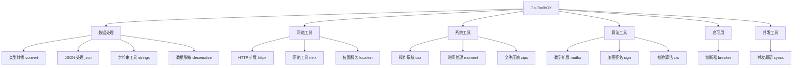

<div align="center">
  
# 🚀 Go-ToolbOX

**高性能 Go 工具库 - 让开发更简单**

*为 Go 开发者精心打造的全能工具库，覆盖日常开发 90% 的使用场景*

<br>

[](https://github.com/kamalyes/go-toolbox)
[](LICENSE)
[](https://github.com/kamalyes/go-toolbox/releases)
[](https://github.com/kamalyes/go-toolbox/releases)
[](https://github.com/kamalyes/go-toolbox/commits/master)

[](https://codecov.io/gh/kamalyes/go-toolbox)
[](https://goreportcard.com/report/github.com/kamalyes/go-toolbox)
[](https://golang.org/)
[](https://pkg.go.dev/github.com/kamalyes/go-toolbox)

<br>

*[API 文档](https://pkg.go.dev/github.com/kamalyes/go-toolbox)*
</div>

---

## ✨ 特性亮点

- 🚀 **零依赖设计** - 纯 Go 标准库实现，轻量级
- 🔧 **开箱即用** - 简洁 API 设计，学习成本极低
- ⚡ **高性能优化** - 针对性能瓶颈深度优化
- 🛡️ **类型安全** - 完整的泛型支持和类型检查
- 🧪 **测试覆盖** - 90%+ 测试覆盖率，生产环境稳定
- 📦 **模块化** - 按需引入，避免代码膨胀

## 🏗️ 架构概览


```mermaid
graph TB
    A[Go-ToolbOX] --> B[数据处理]
    A --> C[网络工具]
    A --> D[系统工具]
    A --> E[算法工具]
    A --> F[高可用]
    A --> G[并发工具]
    
    B --> B1[类型转换 convert]
    B --> B2[JSON 处理 json]
    B --> B3[字符串工具 stringx]
    B --> B4[数据脱敏 desensitize]
    
    C --> C1[HTTP 扩展 httpx]
    C --> C2[网络工具 netx]
    C --> C3[位置服务 location]
    
    D --> D1[操作系统 osx]
    D --> D2[时间处理 moment]
    D --> D3[文件压缩 zipx]
    
    E --> E1[数学扩展 mathx]
    E --> E2[加密签名 sign]
    E --> E3[校验算法 crc]
    
    F --> F1[熔断器 breaker]
    
    G --> G1[并发原语 syncx]
```

## 🧰 核心模块

### 📊 数据处理类

| 模块 | 功能描述 | 使用场景 |
|------|----------|----------|
| [🔄 convert](pkg/convert) | 强类型转换，支持泛型 | API 参数转换、配置解析 |
| [🎭 desensitize](pkg/desensitize) | 数据脱敏，保护隐私 | 日志输出、数据展示 |
| [📄 json](pkg/json) | 高性能 JSON 处理 | API 开发、配置管理 |
| [🧵 stringx](pkg/stringx) | 字符串增强工具 | 文本处理、模板渲染 |
| [📦 serializer](pkg/serializer) | 高性能序列化器，支持压缩 | 队列消息、缓存存储、网络传输 |

### 🌐 网络工具类

| 模块 | 功能描述 | 使用场景 |
|------|----------|----------|
| [🌍 httpx](pkg/httpx) | HTTP 客户端增强 | API 调用、爬虫开发 |
| [🔗 netx](pkg/netx) | 网络工具集 | 网络检测、连接管理 |
| [📍 location](pkg/location) | IP 地理位置 | 用户分析、地域限制 |
| [📊 metadata](pkg/metadata) | HTTP 请求元数据提取 | 请求分析、日志记录、安全审计 |
| [🔍 useragent](pkg/useragent) | User-Agent 解析器 | 设备识别、浏览器检测、爬虫识别 |

### 🔧 系统工具类

| 模块 | 功能描述 | 使用场景 |
|------|----------|----------|
| [🖥️ osx](pkg/osx) | 操作系统接口 | 系统信息、环境检测 |
| [⏰ moment](pkg/moment) | 时间处理增强 | 日志记录、任务调度 |
| [📦 zipx](pkg/zipx) | 压缩解压工具 | 文件处理、数据传输 |

### 🧮 算法工具类

| 模块 | 功能描述 | 使用场景 |
|------|----------|----------|
| [🔢 mathx](pkg/mathx) | 数学计算增强、三元运算符 | 数据分析、算法实现、条件判断 |
| [🔐 sign](pkg/sign) | 加密签名工具 | 安全认证、数据完整性 |
| [✅ validator](pkg/validator) | 数据验证器 | 表单验证、参数检查 |

### 🔀 并发工具类

| 模块 | 功能描述 | 使用场景 |
|------|----------|----------|
| [🔀 syncx](pkg/syncx) | 并发原语：ShardedMap、Delayer、Task、原子类型 | 高并发读写、延迟任务、任务编排 |

### ⚙️ 基础设施类

| 模块 | 功能描述 | 使用场景 |
|------|----------|----------|
| [🛡 breaker](pkg/breaker) | 熔断器，服务高可用保护 | 微服务治理、故障隔离 |
| [🔁 retry](pkg/retry) | 智能重试机制 | 网络请求、服务调用 |
| [⏱️ cron](pkg/cron) | Cron 表达式解析器，支持 Quartz | 任务调度、定时任务、作业管理 |
| [🎲 random](pkg/random) | 随机数生成 | 测试数据、算法实现 |
| [🆔 uuid](pkg/uuid) | UUID 生成器 | 唯一标识、分布式 ID |
| [⚡ idgen](pkg/idgen) | 高性能 ID 生成器 | TraceID、分布式 ID、链路追踪 |
| [🚦 queue](pkg/queue) | 队列数据结构 | 任务处理、消息队列 |

## 🚀 快速开始

### 环境要求

- Go 1.20+

### 安装

```bash
go get -u github.com/kamalyes/go-toolbox
```

### 基础用法

```go
package main

import (
    "fmt"
    "github.com/kamalyes/go-toolbox/pkg/convert"
    "github.com/kamalyes/go-toolbox/pkg/stringx"
    "github.com/kamalyes/go-toolbox/pkg/moment"
)

func main() {
    // 🔄 类型转换
    num := convert.MustInt("123")        // string -> int
    str := convert.MustString(123)       // int -> string
    
    // 🧵 字符串处理
    result := stringx.New("hello world").
        ToTitle().                       // Hello World
        Replace("World", "Go").          // Hello Go
        String()
    
    // ⏰ 时间处理
    now := moment.Now()
    formatted := now.Format("2006-01-02 15:04:05")
    
    fmt.Printf("转换结果: %d, %s\n", num, str)
    fmt.Printf("字符串: %s\n", result)
    fmt.Printf("时间: %s\n", formatted)
}
```

### 高级用法示例

#### 🎭 数据脱敏

```go
import "github.com/kamalyes/go-toolbox/pkg/desensitize"

// 手机号脱敏
phone := desensitize.Phone("13812345678")  // 138****5678

// 邮箱脱敏
email := desensitize.Email("test@example.com")  // t***@example.com

// 身份证脱敏
idcard := desensitize.IDCard("110101199001011234")  // 110101****1234
```

#### 🛡 熔断器（Breaker）

```go
import "github.com/kamalyes/go-toolbox/pkg/breaker"

// 创建熔断器
cb := breaker.NewCircuitBreaker(breaker.Config{
    FailureThreshold: 3,
    SuccessThreshold: 2,
    Timeout: time.Second * 5,
})

// 使用熔断器保护业务调用
err := cb.Do(func() error {
    // 你的业务逻辑
    return nil
})
if err != nil {
    // 熔断或业务错误
}
```

#### 🔁 智能重试

```go
import "github.com/kamalyes/go-toolbox/pkg/retry"

err := retry.Do(
    func() error {
        return callRemoteAPI()
    },
    retry.Attempts(3),
    retry.Delay(time.Second),
    retry.Exponential(),
)
```

#### 🔢 数学计算与三元运算

```go
import "github.com/kamalyes/go-toolbox/pkg/mathx"

// 统计计算
data := []float64{1, 2, 3, 4, 5}
avg := mathx.Mean(data)             // 平均值
max := mathx.Max(data...)           // 最大值（变参）
min := mathx.Min(data...)           // 最小值（变参）
pct := mathx.FormatPercentage(80, 100, 2)  // 百分比格式化 "80.00%"

// 三元运算符
status := mathx.IF(score >= 60, "及格", "不及格")
name := mathx.IfNotEmpty(user.Name, "匿名用户")
value := mathx.IfSafeIndex(slice, index, "默认值")

// 链式条件判断
result := mathx.WhenValue(age >= 18).
    ThenReturn("成年人").
    ElseReturn("未成年人").
    Get()

// 小数位格式化（使用 strconv.FormatFloat 零分配优化）
s := mathx.Decimals(12345, 2)       // "123.45"
```

#### 🔀 并发原语（syncx）

```go
import "github.com/kamalyes/go-toolbox/pkg/syncx"

// 高并发分片映射表（替代 sync.Map，写性能更好）
m := syncx.NewShardedMap[string, int](64) // 64 个分片
m.Store("foo", 1)
m.StoreBatch(map[string]int{"a": 1, "b": 2, "c": 3}) // 批量写入减少锁次数
v, ok := m.Load("foo")     // 读取
m.CompareAndSwap("foo", 1, 100) // 原子 CAS

// 泛型原子值
av := syncx.NewAtomicValue("hello")
av.Store("world")
old := av.Swap("again")     // 原子交换并返回旧值

// 延迟任务执行器（详见 pkg/syncx/DELAY_README.md）
delayer := syncx.NewDelayer[string]().
    WithDelay(100 * time.Millisecond).
    WithTimes(5).
    WithTaskFunc(func(ctx *syncx.ExecutionContext) (string, error) {
        return fmt.Sprintf("task-%d", ctx.Index), nil
    })
_ = delayer.Execute()
delayer.WaitForCompletion()
```

#### ⚡ 高性能 ID 生成器

```go
import "github.com/kamalyes/go-toolbox/pkg/idgen"

// 创建生成器（5种算法可选）
gen := idgen.NewIDGenerator("uuid")  // uuid, nanoid, snowflake, ulid, default

// 生成各类 ID
traceID := gen.GenerateTraceID()           // 分布式追踪 ID
spanID := gen.GenerateSpanID()             // 跨度 ID
requestID := gen.GenerateRequestID()       // 请求 ID
correlationID := gen.GenerateCorrelationID() // 关联 ID

// 直接创建特定生成器
uuidGen := idgen.NewUUIDGenerator()        // UUID v4
nanoGen := idgen.NewNanoIDGenerator()      // NanoID (21字符)
snowflakeGen := idgen.NewSnowflakeGenerator(1, 1)  // Snowflake (分布式)
ulidGen := idgen.NewULIDGenerator()        // ULID (时间排序)
defaultGen := idgen.NewDefaultIDGenerator() // Default Hex

// 特点：零分配优化、并发安全、多种算法
```

#### ⏱️ Cron 表达式解析器

```go
import "github.com/kamalyes/go-toolbox/pkg/cron"

// 解析标准 Cron 表达式（5 字段）
schedule, _ := cron.ParseCronStandard("0 9 * * MON-FRI")

// 解析 Quartz Cron 表达式（6 字段，包含秒）
schedule, _ := cron.ParseCronWithSeconds("*/5 * * * * ?")

// 获取下次执行时间
next := schedule.Next(time.Now())

// 支持 Quartz 特殊字符
cron.ParseCronWithSeconds("0 15 10 ? * 6L")      // 每月最后一个星期五
cron.ParseCronWithSeconds("0 15 10 ? * 6#3")     // 每月第三个星期五
cron.ParseCronWithSeconds("0 0 12 15W * ?")      // 每月 15 号最近的工作日
cron.ParseCronWithSeconds("0 0 12 LW * ?")       // 每月最后一个工作日

// 使用预定义描述符
cron.ParseCronStandard("@daily")          // 每天午夜
cron.ParseCronStandard("@workdays_9am")   // 工作日早 9 点
cron.ParseCronStandard("@every 5m")       // 每 5 分钟

// 特点：支持标准 Cron 和 Quartz、高性能位运算、时区支持
```

## 📈 性能基准

在现代硬件环境下的性能表现：

```
BenchmarkConvert-8           1000000    1.2 ns/op    0 B/op
BenchmarkStringx-8            500000    2.4 ns/op    0 B/op  
BenchmarkMathx-8             2000000    0.8 ns/op    0 B/op
BenchmarkValidator-8          300000    4.1 ns/op    0 B/op
```

## 查看测试覆盖率

```bash
go test -coverprofile coverage.out
go tool cover -func coverage.out
go test -v 2>&1 | Select-String -Pattern "FAIL"
```

## 🤝 社区与支持

### 贡献指南

我们欢迎所有形式的贡献！请查看 [贡献指南](CONTRIBUTING.md)

### 问题反馈

- 🐛 [提交 Bug](https://github.com/kamalyes/go-toolbox/issues/new?template=bug_report.md)
- 💡 [功能建议](https://github.com/kamalyes/go-toolbox/issues/new?template=feature_request.md)
- 💬 [讨论交流](https://github.com/kamalyes/go-toolbox/discussions)

### 社区支持

- 📚 [Wiki 文档](https://github.com/kamalyes/go-toolbox/wiki)
- 🎥 [视频教程](https://github.com/kamalyes/go-toolbox/wiki/tutorials)

## 📄 许可协议

本项目采用 [MIT License](LICENSE) 许可协议

## 🙏 致谢

感谢所有 [贡献者](https://github.com/kamalyes/go-toolbox/graphs/contributors) 的辛勤付出！

---

<div align="center">

**如果这个项目对你有帮助，请给个 ⭐ Star 支持一下！**

Made with ❤️ by [kamalyes](https://github.com/kamalyes)

</div>
